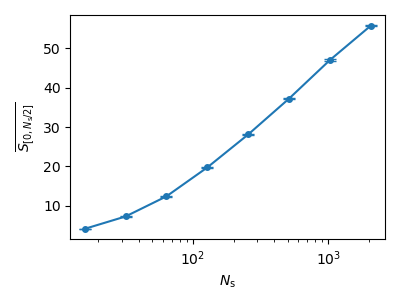

# Lindblad dynamics free fermion chain

- types of trajectory dynamics
  - quantum state diffusion (QSD)
  - "raw" quantum state diffusion mimicking a non-unitary circuit evolution (QSDc)
  - quantum jump evolution (QJ)

- examples
  - QSD: See Fig.4 in https://doi.org/10.21468/SciPostPhys.7.2.024 
    (our gamma/lambda=1 corresponds to their gamma=0.5)
    - time evolution of entanglement entropy 
      
    - distance dependence of entanglement entropy 
      
    - data collapse of entanglement entropy 
      
  - QSD: See Fig.1(c) in https://arxiv.org/abs/2005.09722 
    - size dependence of entanglement entropy at gamma/lambda=0.1 
      
    - size dependence of entanglement entropy at gamma/lambda=0.25 
      

- References
  - https://doi.org/10.21468/SciPostPhys.7.2.024 (hopping: lambda=1/2)
  - https://doi.org/10.1103/PhysRevLett.126.170602 (https://arxiv.org/abs/2005.09722) (hopping: lambda=1)
  - https://arxiv.org/abs/2104.09118 (long-range hopping)
  - (hopping: lambda=1 in our notation)
